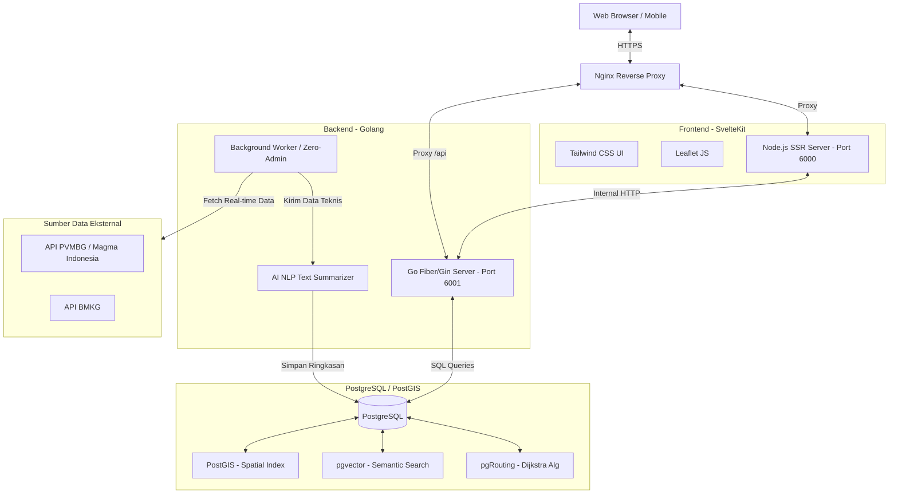

# System Architecture Document - LOKARI

## 1. Arsitektur Infrastruktur (High-Level)
LOKARI menggunakan arsitektur *Decoupled WebGIS* yang bertumpu pada kecepatan pemrosesan spasial di tingkat basis data relasional (*PostgreSQL*) dan konkurensi pemrosesan server (*Golang*).

### 1.1 Diagram Arsitektur

## 2. Arsitektur Basis Data (PostgreSQL, PostGIS, pgvector, pgRouting)
Sesuai dengan proposal, penggunaan MongoDB **TIDAK DIIZINKAN**. Sistem **wajib** menggunakan PostgreSQL karena membutuhkan ekstensi spesifik:
- **PostGIS:** Untuk menyimpan dan melakukan operasi geometri presisi (SRID 4326 WGS 84). Indeks Spasial GiST (Generalized Search Tree) digunakan untuk optimasi pencarian lokasi posko terdekat.
- **pgRouting:** Topologi jaringan jalan (*Network Topology*) dibentuk dari *LINESTRING* jalan desa. Algoritma Dijkstra dieksekusi di dalam database untuk mencari jalur terpendek (Cost = Jarak). Jika jalan memotong KRB (Kawasan Rawan Bencana), *Cost* menjadi tak terhingga (*Dynamic Hazard Avoidance*).
- **pgvector:** Teks pertanyaan pengguna dan deskripsi lokasi dikonversi menjadi vektor. Basis data melakukan *Dense Passage Retrieval* berdasarkan kemiripan cosinus (Cosine Similarity).

## 3. Arsitektur Backend (Golang)
- **Zero-Admin Engine:** Sebuah Goroutine yang berjalan di latar belakang secara periodik (misal setiap 10 menit). Menarik data dari API PVMBG (Status Gunung, Tremor) dan BMKG (Curah hujan).
- **AI NLP Summarizer:** Modul Go yang terintegrasi dengan model NLP lokal/API (seperti HuggingFace/OpenAI) untuk menerjemahkan angka teknis menjadi satu paragraf bahasa Indonesia yang mudah dimengerti (Alert Banner).

## 4. Arsitektur Frontend (SvelteKit)
- **Active and Simplified UI:** Kode SvelteKit akan merender Leaflet.js. Seluruh rute (GeoJSON *LineString*) dan poligon (GeoJSON *Polygon*) disuplai dari Golang API.

## 5. Arsitektur Deployment & Server Environment
- Server menggunakan sistem operasi Linux.
- **Process Manager:** `PM2` atau `Docker` menjaga peladen *backend* (port 6001) dan *frontend* (port 6000) selalu hidup (*uptime*).
- **Reverse Proxy:** Nginx mengarahkan *traffic* port 80/443 ke *port internal* yang berjalan tanpa terjadi tabrakan.

---
*Status: SELARAS DENGAN PROPOSAL AKADEMIK*
