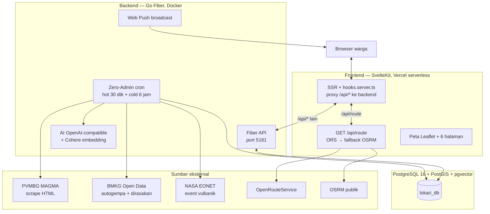

# Arsitektur Sistem — LOKARI

> Menggambarkan sistem **sebagaimana diimplementasikan**, bukan sebagaimana
> diusulkan di proposal. Terakhir diselaraskan dengan kode: Oktober 2026.

## 1. Gambaran umum

Tidak ada Nginx di dalam compose. Peran reverse-proxy dipegang
`hooks.server.ts` (prod) dan proxy Vite (dev). Nginx hanya opsi manual di
VPS (lihat README §6).

## 2. Frontend (SvelteKit 2 + Svelte 5 runes)

- **Stack**: SvelteKit 2, Svelte 5 (runes `$state`/`$derived`/`$effect`),
  Tailwind CSS v4, Leaflet 1.9, lucide-svelte. Adapter `adapter-vercel`,
  runtime `nodejs22.x` (jangan pindah ke `edge` — `hooks.server.ts` dan
  `+server.ts` butuh Node runtime).
- **Halaman** (6): `/` (beranda: kartu status Kelud + peta + berita),
  `/danger-map`, `/safe-routes`, `/news`, `/search`, `/about`.
- **i18n**: ID/EN via store kustom `src/lib/i18n.svelte.ts`
  (`localStorage: lokari-locale`). Paket `@inlang/paraglide-js` terpasang
  tapi **tidak dipakai** — jangan impor dari sana.
- **Tema**: terang/gelap via `src/lib/theme.svelte.ts`
  (`localStorage: lokari-theme`).
- **Peta**: `KeludMapView.svelte` — Leaflet dimuat dinamis (hindari SSR
  issue). Tile Google Satellite Hybrid tanpa API key (isu terbuka, TODO 5.2).

### Zona bahaya & rute (pengganti pgRouting)

- **Tidak ada pgRouting di database** — ekstensi yang diinstal hanya
  `postgis`, `uuid-ossp`, `vector` (lihat `docs/Schema.md`).
- Zona KRB = **lingkaran Leaflet hardcoded** di frontend (radius 5/10/15 km
  dari kawah) + poligon batas Desa Jarak dari
  `src/lib/data/desa_jarak.json`. Bukan poligon dari database.
- Rute evakuasi = `GET /api/route` (SvelteKit): OpenRouteService dengan
  `avoid_polygons` → fallback OSRM publik. Detail kontrak: `docs/API.md`.

## 3. Backend (Go Fiber)

- Entrypoint `backend/cmd/server/main.go`: Fiber (`BodyLimit` 64 KB),
  middleware logger + recover, CORS whitelist
  (`http://localhost:5180,http://localhost:5173`, override via
  `CORS_ORIGINS`). DB pool `jackc/pgx` — boleh `nil` (semua handler guard
  `h.DB == nil`, server tetap hidup tanpa DB).
- Rate limit 30 req/menit/IP di `POST /api/search` dan `GET /api/alert`
  (kuota AI berbayar).

### Zero-Admin worker (`internal/worker/cron.go` + `internal/service/`)

| Loop | Jadwal | Job | Notifikasi push |
|---|---|---|---|
| Hot | tiap 30 dtk (mutex anti-tumpang-tindih) | Gempa BMKG terbaru (filter magnitudo ≥ 3.5 + radius dinamis dari Kelud, dedupe via `monitor_state`) | Ya, kategori `warning` |
| Hot | tiap 30 dtk | Status Kelud dari **scrape** halaman MAGMA PVMBG (perubahan Level I–IV naik/turun), state di `monitor_state` | Ya, kategori `volcano` |
| Cold | tiap 6 jam | Laporan harian MAGMA (7 hari terakhir, rutin) | Tidak |
| Cold | tiap 6 jam | Event vulkanik NASA EONET dalam radius 150 km dari Kelud | Ya bila kategori `warning`/`volcano`/`evac` |

Semua insert berita memakai `ON CONFLICT (sumber, judul) DO NOTHING`
(anti-duplikat, lihat `docs/Schema.md` §2.4). Trigger manual tanpa tunggu
jadwal: `go run scripts/ops.go hot|cold|all`.

### AI (`internal/ai/nlp.go`)

- **Ringkasan berita**: provider OpenAI-compatible apa pun (OpenRouter,
  Groq, DeepSeek, …) via env `AI_API_KEY`/`AI_BASE_URL`/`AI_MODEL`.
  Output JSON dipaksa (`parseNewsItem` toleran code fence + retry 2x).
- **Embedding search**: Cohere `embed-multilingual-v3.0`, vektor 1024
  dimensi, query pgvector `ORDER BY embedding <=> $1 LIMIT 15` (backend
  me-retrieve, frontend me-rerank berdasar jarak fisik).
- Jika AI gagal, worker memakai teks fallback deterministik (bukan gagal
  total) — kecuali berita EONET yang memang butuh AI.

### Web Push

Browser subscribe via `POST /api/subscribe` (butuh HTTPS/`localhost` +
izin notifikasi, dioptimalkan dengan retry + fallback saat tab fokus).
Setiap berita baru kategori penting memicu `broadcastPush` (urgency high,
TTL 1 jam). Subscription mati (HTTP 410/404) dibersihkan otomatis.
Uji manual: `go run scripts/ops.go push` (demo 4 jenis notif, jeda 6 dtk);
generate key: `go run scripts/ops.go vapid`.

## 4. Deployment & port

| Layanan | Dev Docker | Dev manual | Prod |
|---|---|---|---|
| Frontend | `localhost:5180` (vite dev, hot reload) | `localhost:5173` | Vercel serverless (Root Directory `frontend`) |
| Backend | `localhost:5181` (air hot reload) | `localhost:5181` | Docker image prod (binary statis, user `app`, healthcheck `/api/health`) |
| Database | `localhost:5433` → container `5432` | sama | Internal compose network saja (tidak di-expose) |
| Adminer | `localhost:8080` | — | Tidak ada (dev only) |

- `docker compose up` (default) = dev: override mengaktifkan frontend,
  Adminer, dan publikasi port DB. `docker-compose.yaml` saja (tanpa
  override) = backend + DB saja.
- Backend prod membundel binary operasional (`lokari-migrate`,
  `lokari-seed`, `lokari-ops`) karena image prod tanpa toolchain Go.
- Database: `pgvector/pgvector:pg16` + PostGIS 3 (lihat peringatan di
  `docs/Schema.md` soal image yang jangan dipakai).
- **Tidak ada PM2** di alur mana pun (dokumen lama menyebutnya — basi).

Lihat `README.md` untuk langkah deploy Vercel dan VPS.
